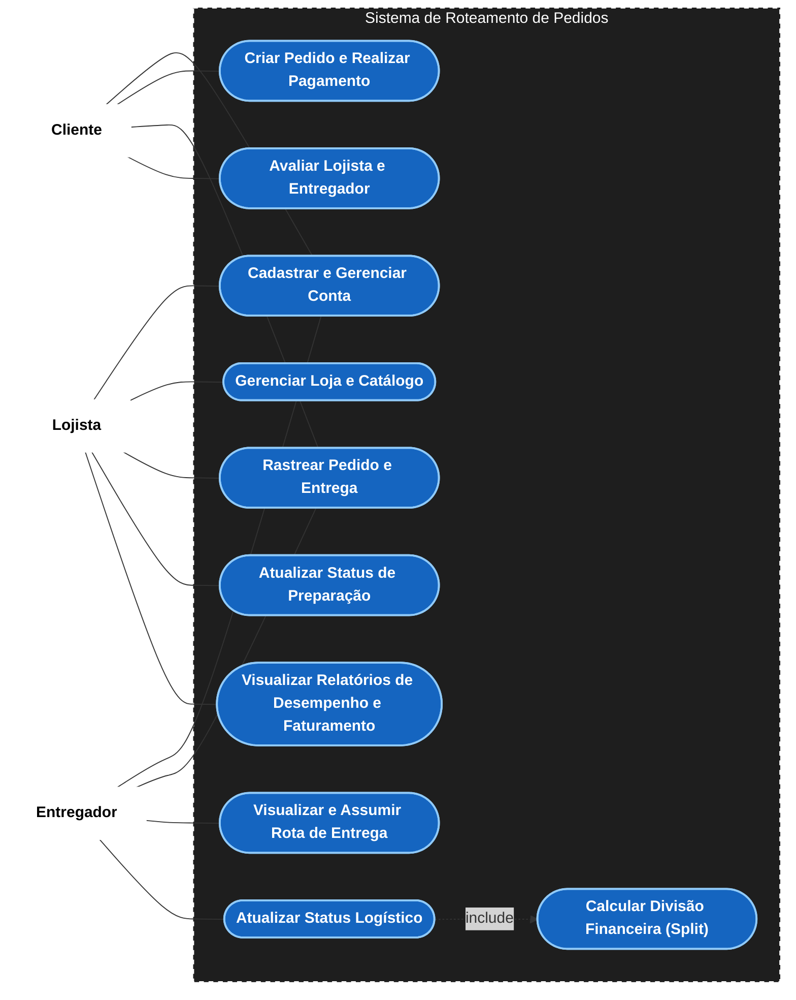

# Diagrama de Casos de Uso

### Mapeamento: Casos de Uso Principais vs. Entidades Envolvidas

Para garantir a rastreabilidade entre os fluxos de interação e o modelo de banco de dados, mapeamos as entidades manipuladas pelos 3 Casos de Uso críticos do sistema:

1. **Fazer Pedido (UC1)**
   - **Ator:** Cliente
   - **Entidades Envolvidas:** `Cliente` (quem faz), `Loja` (de onde compra), `Produto` (o que compra), `Pedido` (a transação), `Item_Pedido` (as quantidades e preços) e `Endereço` (destino).

2. **Aceitar Corrida / Assumir Rota (UC8)**
   - **Ator:** Entregador
   - **Entidades Envolvidas:** `Entregador` (quem aceita), `Rota` (o agrupador logístico), `Entrega` (a tarefa) e `Historico_Status_Entrega` (auditoria do aceite).

3. **Finalizar Entrega / Atualizar Status (UC9)**
   - **Ator:** Entregador
   - **Entidades Envolvidas:** `Entrega` (atualização do status final), `Historico_Status_Entrega` (auditoria da conclusão) e o acionamento via _include_ da `Divisao_Pagamento` (Split).
